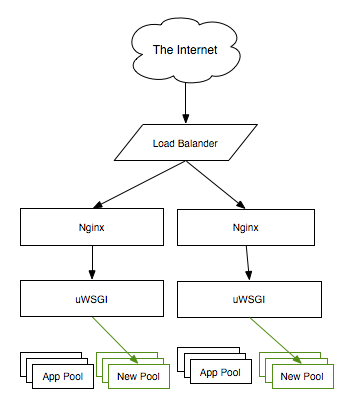

# Gracefull Fast Python Deployments

Alex Kessinger, Software Architect @ bepress

<div class='notes'>
Hi, My name is Alex Kessinger. I am a software architect at bepress. We build a type of product called an Instiution Repository.
</div>

---

# Agenda

- Gracefull Fast Deployments
- Defenitions
- Gracefull Reloading Intro
- Python application deployment

<div class='notes'>
I've been working with python software for over 10 years professionally. I have been using it for build websites the entire time. I want to share with you some of the details of how I have been deploying python web applications for the last 5 years.
</div>

---

# Defenitions

- Graceful
- Deployments
- Artifact

<div class="notes">
Gracefull means without disruption

Deployments mean deploying an isolated python application and environemtn to N number of boxes running N number of services.

Artifact all the code and dependencies needed to run an application. Does not nescearyl include all the "system" packages to run.
</div>

---

# Load Balancer Primer (Intro?)

<div class="notes">
I've learned over the years too not assume anything about a person understanding of load balancers, so I want to cover this briefly, and then I will get into graceful deployments.
</div>

---


<div class="notes">
- Explain normal state of the world
- But Now you want to do new deploy
- But you don't want to disrupt user flow
- Where uWSGI helps
</div>

---


---




---


---

# Application Builds

---


---

# Deployment Target State

For a given application on a box:

```
mkdir /srv/application
mkdir /srv/application/builds/current
mkdir /srv/application/etc
mkdir /srv/application/var/logs
```

<div class='notes'>
This is the state I get a box into before deployments happen.

I don't always run multiple apps on a box, but I always plan for it to happen.

This folder scheme allows me to run multiple apps on the same box without conflict.

The applicaton writes locs to this folder, and logs are forwarded to a central location.
</div>
---

# Application Deployments

- Artifact based (no moving parts)
- Push artifact (code + dependencies) to server
- Update symlink
- Trigger reload
- 1 minute or less in my experience

```
mv artifact to ~/builds/app-name-053462-000010
symlink ~/builds/current to ~/builds/app-name-053462-000010
touch ~/etc/uwsgi.conf  # Trigger uwsgi to do graceful reload
```

---

# Rollbacks?

- Just move the symlink back

---

# Relocatable Virtualenv

- Build on the same cpu arch as production
- Source the virtualenv in production
- Just one wierd trick

---

# Change the #!

On Dev

```
#! /home/akessinger/code/project/.venv/bin/python
```

On Production

```
#! /srv/project/builds/current/.env/bin/python
```

---


# Example Code

[https://goo.gl/9fe2Mr](https://goo.gl/9fe2Mr)

